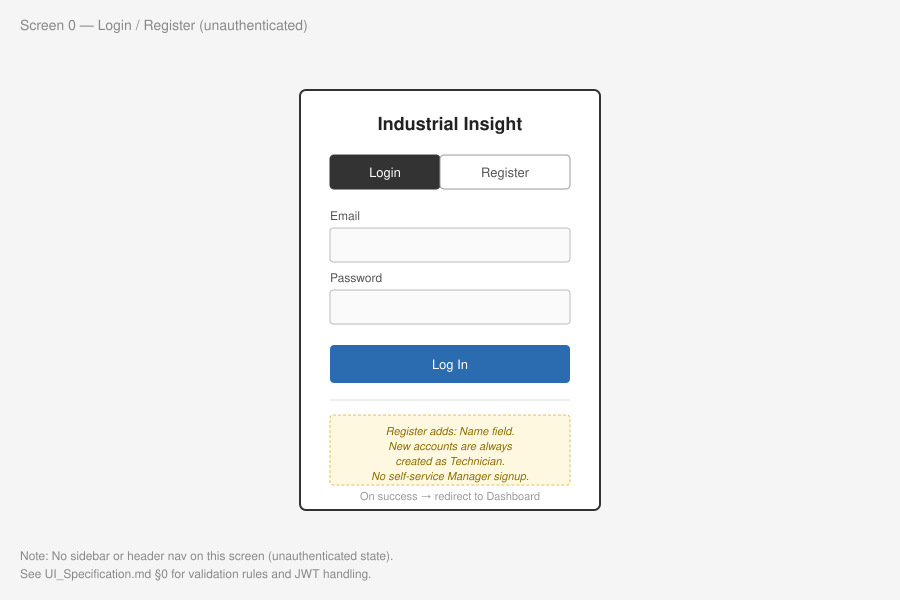
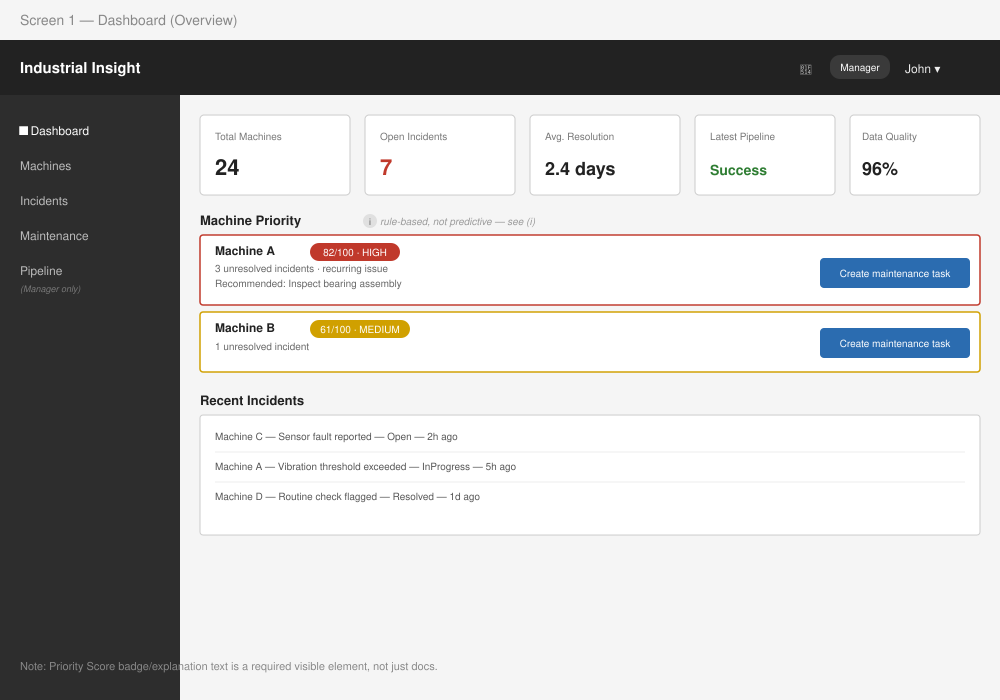
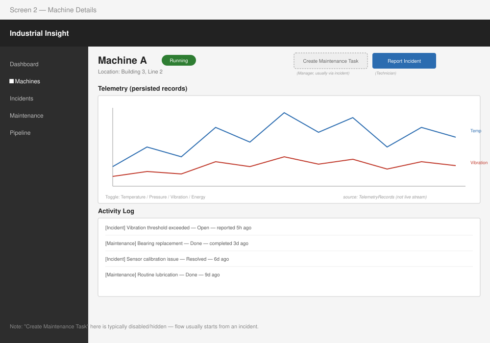
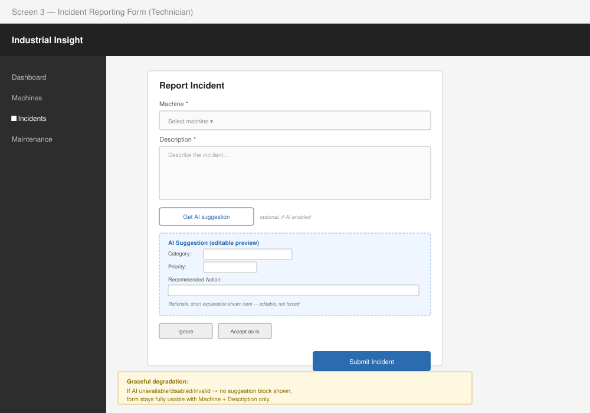
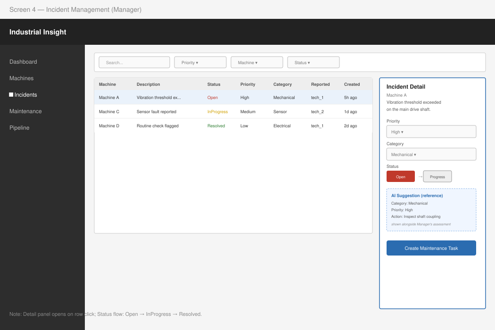
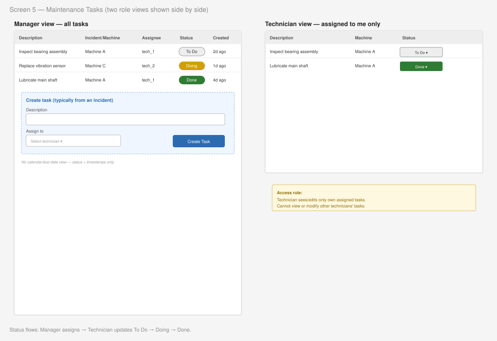
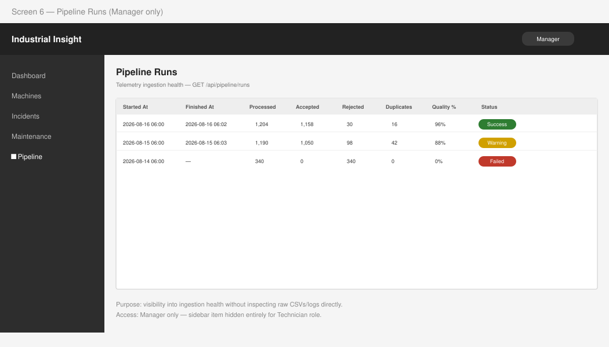

# UI Specification & Wireframes

Roles referenced below are **Technician** and **Manager**, matching the rest of the project documentation.

Each screen section below combines a **wireframe** (visual layout — see linked SVG) with the **specification** (what's on screen, how it behaves, and edge cases). The wireframes are intentionally low-fidelity: they show structure, hierarchy, and role differences, not final visual design.

## 0. Login / Register



- **Layout:** Centered form, no sidebar/navigation (unauthenticated state).
- **Fields:** Email, Password (login); Name, Email, Password (register).
- **Behavior:** New self-registered accounts are created as **Technician**. There is no self-service option to register as Manager — Manager accounts are seeded or otherwise controlled.
- **On success:** Redirect to Dashboard (or Machines list) with JWT stored in memory/context.

## 1. Dashboard (Overview)



- **Header:** User profile, role badge (Technician/Manager), logout, notifications.
- **Left Sidebar:** Navigation — Dashboard, Machines, Incidents, Maintenance, Pipeline (Pipeline visible to Manager only).
- **Main Area:**
  - **Top Stats:** Summary cards — Total Machines, Open Incidents, Average Resolution Time, Latest Pipeline Status, Pipeline Data-Quality %.
  - **Priority Score List:** Ranked, actionable list of machines — not just a passive stat grid. Each row shows machine name, score (0–100) with HIGH/MEDIUM/LOW bucket, contributing factors (e.g. "3 unresolved incidents · recurring issue"), and a direct "Create maintenance task" action.

    ```text
    Machine A — Priority 82/100 — HIGH
    3 unresolved incidents · recurring issue
    Recommended action: Inspect bearing assembly
    [Create maintenance task]
    ```

  - **Bottom:** Recent incidents feed.
- **Note:** The Priority Score is rule-based and explainable (open incident count, severity, recurrence) — not a predictive model. This should be visually/textually clear on the dashboard, not just in documentation.

## 2. Machine Details



- **Header:** Machine Name, Status badge, Location.
- **Sidebar:** Standard navigation.
- **Main Area:**
  - **Telemetry Chart:** Line chart of recent telemetry (Temperature / Pressure / Vibration / Energy) sourced from persisted `TelemetryRecords`, not live streaming.
  - **Actions:** "Report Incident" (Technician), "Create Maintenance Task" (Manager, typically from an incident rather than directly from this page).
  - **Activity Log:** Historical incidents and completed maintenance tasks for this machine.

## 3. Incident Reporting Form (Technician)



- **Fields:** Machine selector, Description (free text).
- **Optional AI assistance:** If the AI-assisted assessment feature is enabled and available, after entering a description the Technician can request a suggestion. The suggestion (Category, Priority, Recommended Action, short rationale) is shown as an editable preview — the Technician can accept it as-is, edit it, or ignore it entirely before saving.
- **Graceful degradation:** If the AI service is unavailable, disabled, or returns an invalid response, no suggestion block is shown and the form remains fully usable — the incident can still be submitted with just the description.
- **Validation:** Machine and Description are required; inline error states for missing/invalid input.

## 4. Incident Management Screen (Manager)



- **Main Area:**
  - **Filter Bar:** Search/filter by priority, machine, status.
  - **Table:** List of incidents — Machine, Description (truncated), Status, Priority, Category, Reported By, Created At.
  - **Detail Panel:** Opens on row click. Allows the Manager to set Priority/Category and update Status (`Open → InProgress → Resolved`). If an AI suggestion exists on the incident, it is shown as reference alongside the Manager's own assessment.
  - **Action:** "Create Maintenance Task" directly from an open incident.

## 5. Maintenance Tasks



- **Manager view:** List of all tasks — Description, linked Incident/Machine, Assignee, Status, Created/Completed dates. Manager creates and assigns new tasks from an incident.
- **Technician view:** List filtered to tasks assigned to the logged-in Technician only. Status update control (`To Do → Doing → Done`). A Technician cannot see or modify tasks assigned to other Technicians.
- **Layout:** List view (Status column with dropdown/select). A calendar/due-date view is not included, since the current data model does not track a due date — task lifecycle is tracked via status and timestamps only.

## 6. Pipeline Runs (Manager)



- **Main Area:**
  - **Table:** Recent `PipelineRun` entries — Started At, Finished At, Records Processed/Accepted/Rejected, Duplicates, Data-Quality %, Status.
  - **Purpose:** Gives the Manager visibility into telemetry ingestion health without needing to inspect raw CSVs or logs directly.
- **Access:** Manager only, consistent with the API contract (`GET /api/pipeline/runs`).
