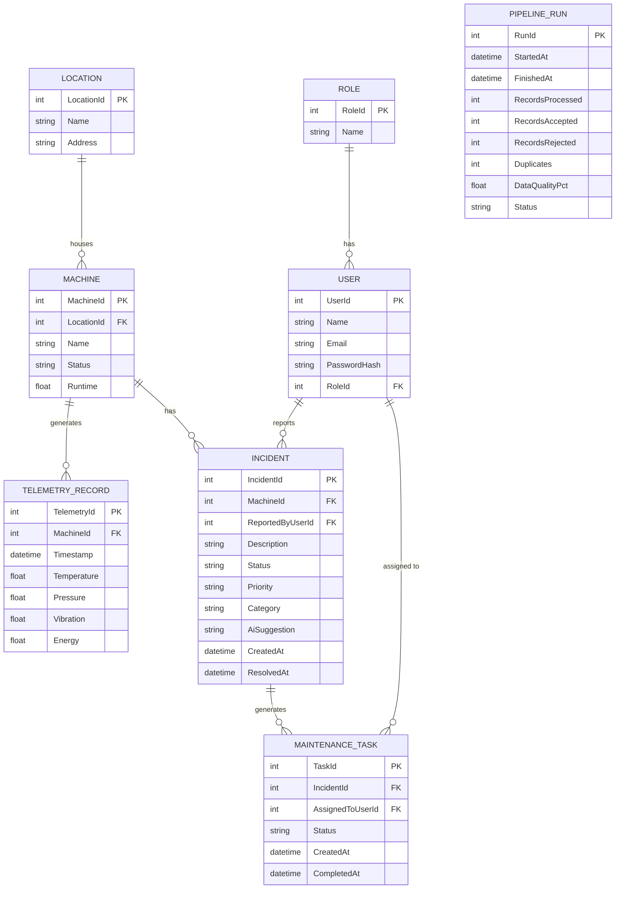

# Entity-Relationship Diagram

This ERD reflects the data model defined in `Project_Product_Specification.md` (Database Planning section). Field names use PascalCase to match the C#/EF Core convention used in the backend.

## Notes

- **`ROLE`** is constrained in practice to two values: `Technician` and `Manager`. New self-registered accounts default to `Technician`; `Manager` accounts are seeded or otherwise controlled — there is no open self-registration path to `Manager`.
- **`INCIDENT.Priority`** and **`INCIDENT.Category`** may be set manually by a Manager, or populated from the optional AI-assisted assessment (see `AiSuggestion`). They are plain fields, not a separate table, since the AI output is a suggestion attached to a single incident rather than a reusable entity.
- **`INCIDENT.AiSuggestion`** is optional and only populated if the AI-assisted incident assessment feature is implemented and available at the time of reporting. It stores the structured suggestion (`category`, `priority`, `recommendedAction`, `rationale`) as validated JSON. If the AI feature is not implemented, this field remains empty/unused.
- **`INCIDENT.ResolvedAt`** is nullable and is the timestamp used to calculate Average Resolution Time (`CreatedAt → ResolvedAt`). Completion of the associated `MAINTENANCE_TASK` may be the event that sets it.
- **`MACHINE`** intentionally does not include `SerialNumber` or `Model` — these are out of scope for the current data model; only `Name`, `Status`, `Runtime`, and `LocationId` are tracked, matching the Planning Template.
- **`MAINTENANCE_TASK`** does not include a `DueDate` field in the current scope; task lifecycle is tracked via `Status`, `CreatedAt`, and `CompletedAt` only.
- **`MAINTENANCE_TASK` does not duplicate `MachineId`.** The machine is reachable via `MAINTENANCE_TASK → INCIDENT → MACHINE`. This is a deliberate normalization choice — see `decisions/` for rationale if this becomes a query-performance concern later.
- **`PIPELINE_RUN` is an independent log/tracking table.** It is not linked to a specific `MACHINE` via foreign key — a single pipeline run processes telemetry for potentially many machines at once. It is referenced by the dashboard via timestamp/status, not by relational join.
- Relationship cardinality used throughout is **one-to-many**, consistent with the Planning Template's Core Relationships section: `Location → Machine → {TelemetryRecord, Incident}`, `Machine → Incident → MaintenanceTask`, `User → Incident`, `User → MaintenanceTask`.
