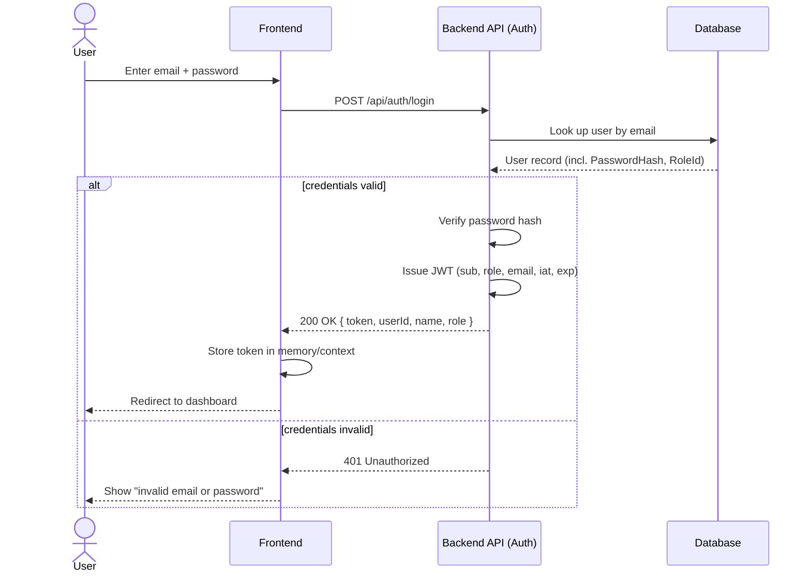
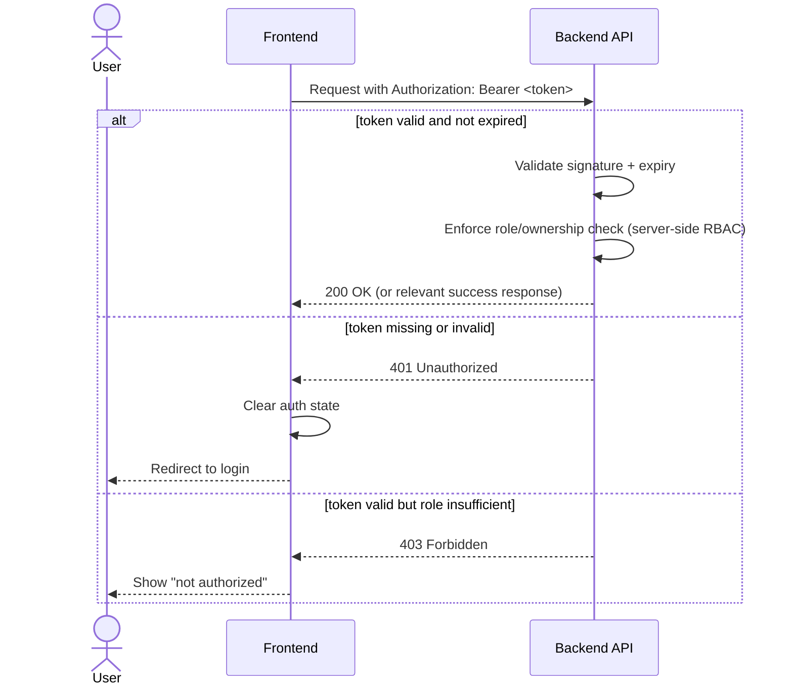
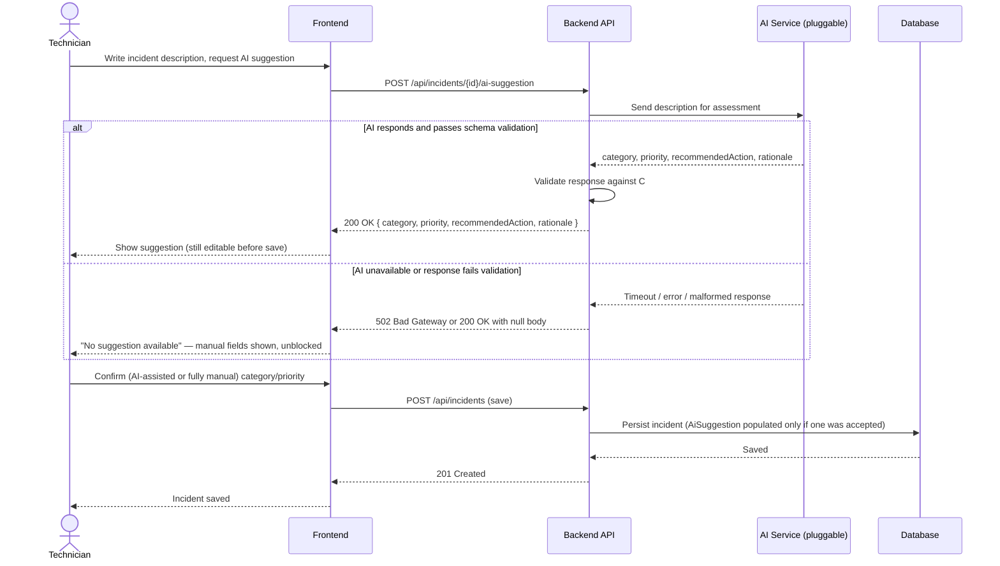

# Sequence Diagrams

These cover the flows worth visualizing separately from `api-contract.md`: authentication (used by every protected request) and the AI-assisted assessment flow (the one flow in the system with a required fallback path). Simple CRUD flows (e.g. `GET /api/machines`) are not included — the request/response shapes in `api-contract.md` are sufficient on their own.

## Login

Reflects `POST /api/auth/login` (see `api-contract.md`) and the JWT strategy decided in `decisions/0004-jwt-auth-strategy.md` (60-minute token, no refresh token, role embedded in claims).

**Subsequent protected requests** (not re-diagrammed per-endpoint — this pattern is constant across the API):

## AI-Assisted Incident Assessment (Optional, P1)

Reflects `POST /api/incidents/{id}/ai-suggestion` in `api-contract.md`. This flow is diagrammed specifically because it has a mandatory fallback path — per `decisions/0002-ai-feature-optional-and-pluggable.md`, the AI feature must never block incident creation, so the "AI unavailable" branch below is not an edge case, it's a first-class outcome.

## Notes

- Both diagrams describe **decided** behavior (from `api-contract.md` and existing ADRs), not new decisions — nothing here should require implementation choices beyond what's already documented.
- The login diagram's "no refresh token" branch is intentionally simple, per ADR 0004: an expired token always results in a hard redirect to login, never a silent retry.
- The AI flow's fallback branch is the more important half of the diagram — it's what makes ADR 0002 ("AI is never a single point of failure") concrete and testable.
